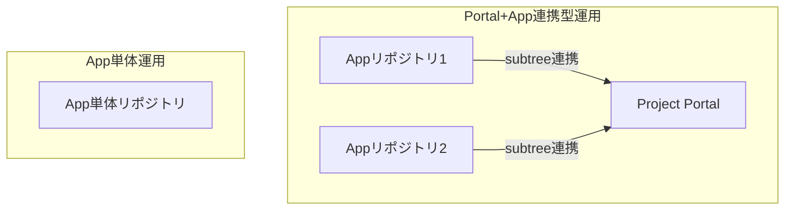

# 運用ガイドライン Home

---

{::options toc_levels="2..3" /}
[:toc:]

!!! info "本ガイドの目的"
	本ガイドは、AZAPAエンジニアリング 先進開発部門 第２セクションのGitHub運用・開発・ドキュメント管理の標準を示します。

## 全体像

!!! tip "運用パターン"
	- Portal+App連携型運用
	- App単体運用

## 目次

- [管理者ガイド](admin.md)
- [開発者ガイド](developer.md)
- [ツール仕様](tools.md)
- [アプリ単体運用ガイド](app_standalone.md)

---

各章の詳細は上記リンク先を参照してください。
# 運用ガイドライン Home

## 🎯 目的

本組織では、「**Docs as Code (ドキュメントもコードである)**」を掲げ、  
ソースコードとドキュメントの完全一致を目指します。  
GitHub Actions と Git Subtree を活用した自動連携システムにより、属人化を排除し、常に最新のナレッジが共有される状態を保ちます。  

## 🏗 システムアーキテクチャ

プロジェクトごとに以下の「親子構成」をとります。

| 種類 | 命名規則 | 役割 |
| :--- | :--- | :--- |
| **Portal (親)** | `<Project>_portal` | ドキュメント統合、全体進捗管理、Wiki |
| **App (子)** | `<SpecificApp>_<Language>` | アプリケーションソースコード、詳細仕様書 |

### 自動連携フロー

1. **開発**: 子リポジトリでコードと `docs/` を修正してPush。
2. **通知**: GitHub Actions で親リポジトリへ更新を通知。
3. **同期**: 親リポジトリが自動で `git subtree pull` を実行。
4. **統合**: 親リポジトリに統合PRが作成される。

## 🚀 最新プロジェクト: MobilityOps

*coming soon...*